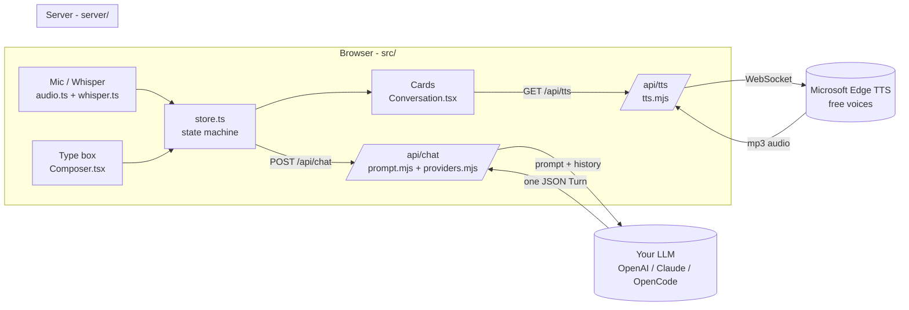

# 话伴 Huaban - How It Works (Architecture Map)

A plain-English map of the whole app, so you can see how the pieces fit and know exactly
where to change things. Read top to bottom; it goes from the big idea down to "edit this file to change that."

---

## 1. The one idea behind the whole app

> **The "tutor" is not code. It is a prompt.**
> The LLM is told to reply with **strict JSON**, and the React UI just renders that JSON as cards.

Everything else (voice in, audio out, scene rotation) is plumbing around that one idea. Once you
get this, the whole project makes sense:

```
You speak/type  ─►  text  ─►  LLM (with a big system prompt)  ─►  one JSON object  ─►  UI cards + native audio
```

The "brain" lives entirely in **`server/prompt.mjs`**. The app is a thin, swappable shell around it.

---

## 2. The big picture (data flow)

```
                        BROWSER (src/)                              SERVER (server/)              OUTSIDE
 ┌──────────────────────────────────────────────┐      ┌──────────────────────────────┐   ┌──────────────┐
 │  You                                          │      │  Express (index.mjs)         │   │              │
 │   │ speak 🎙        │ type ⌨                  │      │   ├ /api/chat  ──────────────┼──►│  Your LLM    │
 │   ▼                 ▼                          │      │   │   uses prompt.mjs +      │   │ (OpenAI /    │
 │  MicRecorder ─► Whisper (offline, in browser) │      │   │   providers.mjs          │◄──┼─ Claude /    │
 │   audio.ts        whisper.ts                   │      │   │                          │   │  OpenCode…)  │
 │        │  (or NVIDIA server, asr.ts)           │      │   ├ /api/tts  ──────────────┼──►│  Edge TTS    │
 │        ▼                                       │      │   │   tts.mjs (WebSocket)    │◄──┼─ (free MS    │
 │      text ─► store.ts (the state machine)      │      │   │                          │   │  voices)     │
 │                │  POST /api/chat ──────────────┼─────►│   ├ /api/config  (config.json)│  │              │
 │                ▼                               │      │   └ /api/scenarios, /voices  │   └──────────────┘
 │      one JSON "Turn"  ◄────────────────────────┼──────┘                              │
 │                │                               │                                     │
 │                ▼  rendered as cards            │                                     │
 │   Conversation.tsx → AgentBubble / Correction  │                                     │
 │   Card / HintCard / Breakdown (per-word pinyin)│                                     │
 │                │                               │                                     │
 │                ▼  each Chinese line ─ GET /api/tts ─► you hear native audio (playTTS) │
 └──────────────────────────────────────────────┘                                     │
```

Mermaid version (renders on GitHub):



---

## 3. What happens, step by step (one round of conversation)

1. **App opens** -> `App.tsx` calls `store.init()` -> asks the server `GET /api/config`. If a model
   and key are set, the app is `ready`. If not, the Settings panel pops up ("Connect a model").
2. **You press start** (`StartScreen.tsx`) -> `store.start()` builds a `START_SESSION` directive
   (telling the model which scenes are already used) and calls `runTurn()`.
3. **The brain runs** -> `store.runTurn()` -> `api.chat(history)` -> `POST /api/chat`. The server
   sends your whole `SYSTEM_PROMPT` + history to the LLM via `providers.mjs`, gets back raw text,
   and `parseTurn()` pulls clean JSON out of it (with **one automatic self-heal retry** if the model
   returns messy JSON).
4. **The UI updates** -> the JSON `Turn` is added to `entries`; `Conversation.tsx` renders it as the
   right card. If the turn was a **correction**, `holding` is set to `true`.
5. **You hear it** -> each Chinese line calls `GET /api/tts` -> `tts.mjs` streams audio from Microsoft
   Edge TTS (free) and **caches the mp3 on disk**, so repeats are instant.
6. **You answer** -> type (`Composer.tsx`) or speak (`MicButton.tsx` / hands-free `VoiceMode.tsx`).
   Speech becomes text via offline Whisper (or the optional NVIDIA server). That text goes to
   `store.sendText()` -> back to step 3. Loop forever.

---

## 4. The contract: 5 kinds of "Turn"

The model must reply with exactly one JSON object. Its `mode` decides which card you see.
This is defined in **`server/prompt.mjs`** (the rules) and mirrored in **`src/types.ts`** (the shapes).

| `mode` | When | What you see | `hold`? |
|---|---|---|---|
| `setup` | First turn of a scene | English scene description + first question in Hanzi | no |
| `question` | You answered fine | The next question, moving the scene along | no |
| `hint` | You typed `hint` | The current question broken word-by-word (never the answer) | no |
| `correction` | You slipped (English / broken / mixed) | Your attempt + grammar fix + vocab + FilChi traps + the better line | **yes** |
| `meta` | You typed `configure` | A plain English reply (e.g. opens settings) | no |

**The HOLD rule** is the heart of the teaching method: after a `correction`, `hold = true`, and the
model is forbidden from asking a new question until you say the corrected line back. That is what
"holds you on a line until you say it right" means.

---

## 5. File-by-file map

### Backend - `server/` (the brain + audio)
| File | What it does |
|---|---|
| `prompt.mjs` | **THE BRAIN.** The full tutor system prompt: golden rules, the HOLD rule, FilChi error traps, and the strict JSON output contract. Change teaching behaviour here. |
| `index.mjs` | The Express server. Routes: `/api/chat` (the brain), `/api/tts`, `/api/config`, `/api/voices`, `/api/scenarios`. Also has the robust JSON parser with a self-heal retry. |
| `providers.mjs` | Talks to your LLM. Two adapters: **OpenAI-compatible** (works for OpenAI, OpenRouter, LM Studio, Ollama, OpenCode Zen) and **Anthropic** (Claude). Picks the vendor from your settings. |
| `tts.mjs` | Free native audio via Microsoft Edge TTS over a raw WebSocket. Handles the security token Microsoft requires, and caches every clip on disk. Holds the 6 voice options. |
| `scenarios.mjs` | The **20-scene pool** (cafe, restaurant, doctor, gym, blind date...). The model rotates through them with no repeats. |
| `opencode-bridge.mjs` | Optional: lets you use free models from an OpenCode subscription. |
| `config.json` | (created at runtime, gitignored) Your provider, model, and API key, stored only on your machine. |

### Frontend - `src/` (the screen)
| File | What it does |
|---|---|
| `lib/store.ts` | **THE STATE MACHINE** (Zustand). Holds everything: config, prefs, the transcript, busy/holding/phase. `runTurn()` is the core loop. Also holds the demo cards (`/?demo=1`). |
| `types.ts` | The JSON contract in TypeScript. The TS twin of `prompt.mjs`. |
| `lib/api.ts` | Tiny fetch wrappers for every server route. |
| `lib/audio.ts` | `MicRecorder` (mic -> 16kHz mono, with a live level so the button pulses) + `playTTS` (one shared audio player). |
| `lib/whisper.ts` + `whisper.worker.ts` | Offline speech-to-text (Whisper via transformers.js) running in a background Web Worker so the UI never freezes. |
| `lib/asr.ts` | Client for the **optional** NVIDIA speech server; auto-falls back to Whisper if it isn't running. |
| `App.tsx` | Top level: shows `StartScreen` (welcome) or `Conversation` (live), plus the Settings panel, the hands-free `VoiceMode` overlay, and error toasts. |
| `components/Conversation.tsx` | Renders the transcript - each `entry` becomes the right card. |
| `components/` (cards) | `AgentBubble`, `UserBubble`, `CorrectionCard`, `HintCard`, `Breakdown` (per-word pinyin), `Composer` (text box), `MicButton` (push-to-talk), `SettingsPanel`, `VoiceMode`. |

### Optional extras
| Path | What it does |
|---|---|
| `asr_server/server.py` | Optional sharper speech recognition (NVIDIA NeMo), runs in WSL on a GPU. Off by default. |
| `scripts/start.cmd` / `start.ps1` | One-click boot of the whole local stack on Windows. |

---

## 6. The hands-free voice loop (`VoiceMode.tsx`)

This is the only "clever" loop in the app. When you go hands-free it runs:

```
while (running):
   if the model is thinking      -> show "Thinking…", wait
   else if there's a new line    -> SPEAK it (TTS), then loop
   else                          -> LISTEN (detect when you start and stop talking)
                                    -> TRANSCRIBE  -> sendText()  -> loop
```

It decides you stopped talking using simple loudness thresholds (`START`, `END`, `SIL_MS`,
`MAX_MS` near the top of the file). Those four numbers are the knobs for "it cuts me off too early"
or "it waits too long."

---

## 7. "I want to change X" cheat-sheet

| You want to... | Edit this |
|---|---|
| Add or change a roleplay scene | `server/scenarios.mjs` |
| Change how the tutor teaches / corrects / its personality | `server/prompt.mjs` (the system prompt) |
| Add a new card type (a new kind of reply) | add a `mode` in `types.ts` + the contract in `prompt.mjs` + a component + wire it in `Conversation.tsx` |
| Add or change a voice | `server/tts.mjs` (`VOICES` list) |
| Change default voice / speed / Whisper model | `src/lib/store.ts` (`DEFAULT_PREFS`) |
| Use a different LLM provider | Settings panel in the app, or `server/providers.mjs` for a new shape |
| Fix "voice mode cuts me off / waits too long" | `src/components/VoiceMode.tsx` (`START` / `END` / `SIL_MS` / `MAX_MS`) |
| Change the look and colors | Tailwind classes in `src/components/*` + `src/index.css` (`ink`, `paper`, `cinnabar`) |

---

## 8. Why it's built this way (the smart parts)

- **Local-first and cheap:** speech-to-text runs offline in your browser (Whisper), and the audio
  out uses free Microsoft voices. The only paid piece is your own LLM key.
- **Provider-agnostic:** because the brain is just a prompt + JSON, you can point it at OpenAI,
  Claude, a local Ollama model, or a free OpenCode model without changing the app.
- **Self-healing JSON:** LLMs sometimes return slightly broken JSON; the server quietly asks the
  model to fix it once instead of crashing.
- **The teaching logic is data, not code:** all the pedagogy lives in one readable prompt file, so
  improving the tutor means editing English, not rewriting the app.
</content>
</invoke>
