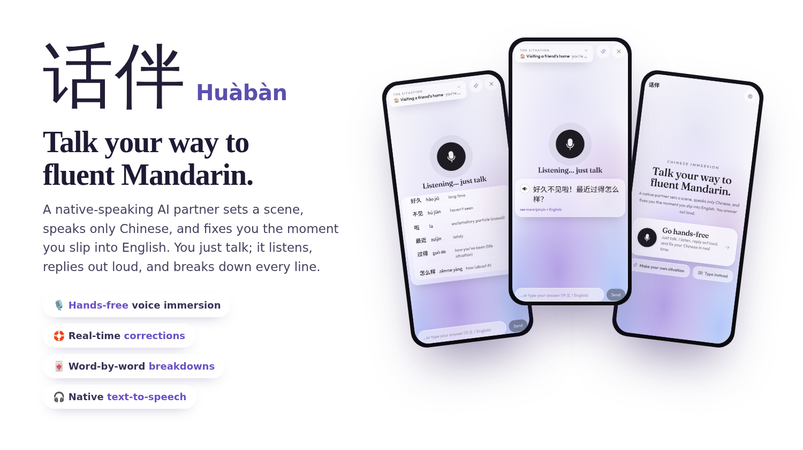
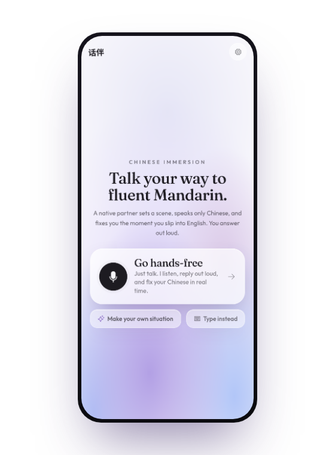
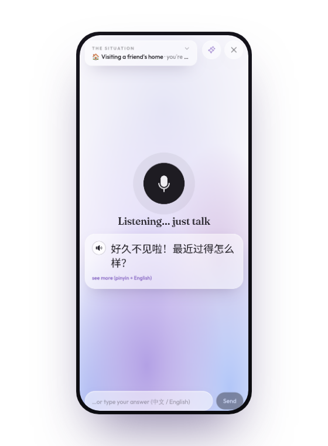
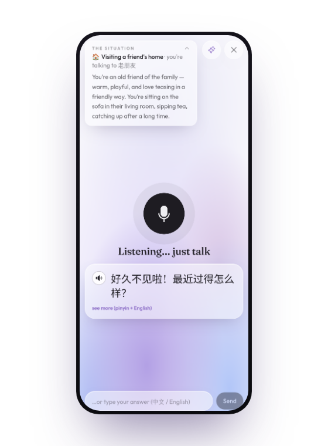
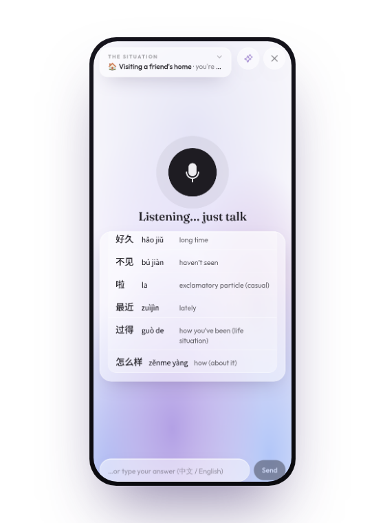

<p align="center">
  
</p>

<h1 align="center">话伴 Huàbàn</h1>

<p align="center">
  <b>Talk your way to fluent Mandarin.</b><br>
  A native-speaking AI partner sets a scene, speaks only Chinese, and fixes you the moment you slip into English.<br>
  You just talk. It listens, replies out loud, and breaks down every line.
</p>

<p align="center">
  <code>Hands-free voice immersion</code> ·
  <code>Real-time corrections</code> ·
  <code>Word-by-word breakdowns</code> ·
  <code>Native text-to-speech</code>
</p>

---

## What it feels like

<table>
  <tr>
    <td width="25%" align="center"></td>
    <td width="25%" align="center"></td>
    <td width="25%" align="center"></td>
    <td width="25%" align="center"></td>
  </tr>
  <tr>
    <td align="center"><b>One tap to start</b><br><sub>Pick a scene or describe your own.</sub></td>
    <td align="center"><b>Go hands-free</b><br><sub>Just talk. It listens and replies out loud.</sub></td>
    <td align="center"><b>Know the scene</b><br><sub>Who you're talking to and why, on tap.</sub></td>
    <td align="center"><b>Every line, decoded</b><br><sub>Hanzi · pinyin · meaning, word by word.</sub></td>
  </tr>
</table>

---

A local-first, **voice-based Chinese immersion tutor**. A native-speaking AI partner picks a
scene, speaks only Mandarin, and corrects you the instant you slip into English. You answer out
loud; it listens, breaks down your mistakes, and holds you on a line until you say it right.

Everything runs on your machine - your API key, your audio, and (optionally) speech recognition
all stay local. You bring your own model: OpenAI, Claude, OpenRouter, a local model via Ollama /
LM Studio, or a free OpenCode model.

## How it works

```
You speak ─► speech-to-text (local) ─► text
                                        │
              the tutor "brain" (an LLM you choose) returns structured JSON
                                        │
     rendered as scene cards · question bubbles · hint cards · correction cards
                                        │
                each Chinese line ─► edge-tts ─► you hear native audio
```

- **Frontend** - Vite + React + Tailwind v4 + Motion. The LLM returns strict JSON; the UI renders it as cards.
- **Backend** (`server/`) - a small Node/Express service that proxies your LLM provider and generates edge-tts audio (`zh-CN-XiaoxiaoNeural`). No Python needed for the core.
- **Speech-to-text** - in-browser Whisper (offline, zero setup) by default, or a bundled local SenseVoice server for sharper Chinese + English recognition (optional, CPU-only).

## Quick start

**Prerequisites:** Node 20+ and one LLM endpoint + key (OpenAI, Anthropic/Claude, OpenRouter, a
local model, or OpenCode).

```bash
# 1. install
npm install

# 2. point it at a model — this file is gitignored and never leaves your machine
cp server/config.example.json server/config.json
#    then edit server/config.json (see "Configure a model" below)

# 3. run (starts the web app + backend together)
npm run dev
```

Open **http://localhost:5180** and start talking. Want to see the UI before wiring up a key?
Open **http://localhost:5180/?demo=1** for a no-API preview.

## Configure a model

There is **no model picker in the UI** by design - the connection lives in `server/config.json`
so the app "just works" once it's set. Edit these fields:

```jsonc
{
  "provider": "openai",     // "openai" (any OpenAI-compatible API) or "anthropic"
  "baseUrl": "",            // "" = provider default, or paste a custom URL ending in /v1
  "model": "gpt-4o-mini",   // the model id
  "apiKey": "sk-...",       // your key
  "temperature": 0.6
}
```

Common setups:

| You want | `provider` | `baseUrl` | `model` |
|---|---|---|---|
| OpenAI | `openai` | `""` | `gpt-4o-mini` |
| Claude (best corrections) | `anthropic` | `""` | `claude-3-5-sonnet-latest` |
| OpenRouter | `openai` | `https://openrouter.ai/api/v1` | any model id |
| Ollama (local) | `openai` | `http://localhost:11434/v1` | `qwen2.5` |
| LM Studio (local) | `openai` | `http://localhost:1234/v1` | the loaded model id |

Edits are picked up on the next message - no restart needed. The tutor leans on JSON-following
ability, so a mid-size or larger instruct model works best.

## Talking to it

- **Speak** with the mic, or **type** in Chinese / English.
- `hint` (or the 💡 button) breaks the current question down word-by-word so you build the answer yourself - it never just hands you the answer.
- After a correction it **holds**: say the corrected line back before it moves on.
- `configure` opens Settings (voice + study options).

### Hands-free

The big **Go hands-free** button on the home screen starts a no-buttons loop: it speaks the
scene, listens, transcribes, replies, speaks back, and listens again. You can also **Make your
own situation** (describe a scene and who the tutor should play), or just type. Tap ✕ to leave.

### Voice settings (Settings ⚙)

- **Speaking voice / speed** - the tutor's TTS (six Mandarin voices, adjustable rate).
- **Always show pinyin + English** - off by default, so you read the Hanzi first and reveal on tap.

## Optional: sharper voice with the local SenseVoice server

By default, speech recognition runs entirely in your browser (offline Whisper, nothing to
install). For crisper recognition - especially **mixed Chinese + English in one breath** - run
the bundled SenseVoice server. It's **CPU-only (no GPU)**, ~1GB RAM, and the app uses it
automatically when it's running (and silently falls back to the browser when it isn't).

```bash
# needs Python 3.9+
pip install -r asr_server/requirements.txt
python asr_server/server.py        # first run downloads the model (~230MB); serves on :8799
```

Hands-free mode shows **"SenseVoice"** when the server is active, **"browser ears"** otherwise.

## Optional: run free via an OpenCode subscription

Some OpenCode plans include free models that are only reachable through the local OpenCode app,
not as a standalone API key. `server/opencode-bridge.mjs` adapts them to the OpenAI shape Huaban
speaks. With the [OpenCode CLI](https://opencode.ai) installed and logged in:

```bash
# 1. start the OpenCode gateway in an empty folder (keeps its context clean)
mkdir -p /tmp/oc-root && cd /tmp/oc-root && opencode serve --port 4097

# 2. start the bridge (from this repo)
OC_URL=http://127.0.0.1:4097 BRIDGE_PORT=8788 node server/opencode-bridge.mjs
```

Then point `server/config.json` at the bridge:

```jsonc
{
  "provider": "openai",
  "baseUrl": "http://127.0.0.1:8788/v1",
  "model": "opencode/deepseek-v4-flash-free",  // or any free opencode/* model
  "apiKey": "anything"                          // the bridge ignores it
}
```

> **Windows:** `scripts/start.cmd` can launch the app plus these optional pieces together. The
> speech-server line in it assumes you've already created the Python env above.

## Ports

| Port | What | Required? |
|---|---|---|
| 5180 | web app (Vite) | yes |
| 8787 | backend (LLM proxy + edge-tts) | yes |
| 8799 | SenseVoice speech server | optional |
| 8788 | OpenCode bridge | optional |
| 4097 | OpenCode gateway | optional |

> On Windows, prefer `127.0.0.1` over `localhost` if you ever see slow first connections -
> `localhost` can resolve to IPv6 first and stall before falling back to IPv4.

## Project layout

```
server/
  index.mjs        routes: /api/chat, /api/tts, /api/config, /api/voices, /api/warm
  prompt.mjs       the immersion-tutor system prompt + strict JSON contract
  scenarios.mjs    the 20-scene pool
  providers.mjs    OpenAI-compatible + Anthropic adapters
  tts.mjs          edge-tts over a direct WebSocket, with on-disk cache
  opencode-bridge.mjs   optional: run free via an OpenCode subscription
  config.example.json   copy to config.json and fill in
src/
  lib/             store (state machine), whisper worker, audio, api, asr (speech-server client)
  components/      StartScreen, Conversation, VoiceMode (hands-free), correction/hint cards, …
asr_server/        optional SenseVoice speech server (Python, CPU)
scripts/           start.cmd / start.ps1 — boot the local stack (Windows)
```

## License

MIT — see [LICENSE](LICENSE).
